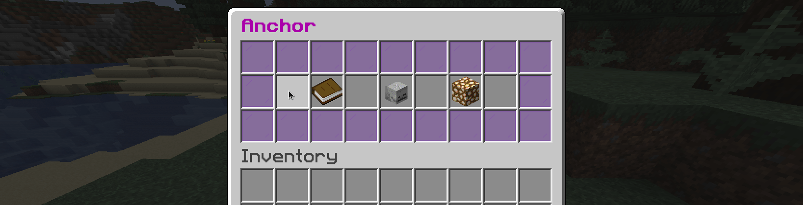

# AnchorSell Minecraft Plugin for Spigot

Minecraft plugin to get money using a Respawn anchor. 

You can earn money automatically by buying an Anchor Sell, ideal for faction servers.

Anchor Sell can also be removed with TNT and keep their characteristics.

You can upgrade the anchors to earn more money!

## Spigot link:
+ [AnchorSell](https://www.spigotmc.org/resources/anchorsell.90038/)

## Dependencies
+ [Vault](https://www.spigotmc.org/resources/vault.34315/)

## Soft-dependencies (optionals)
+ [FactionsX](https://www.spigotmc.org/resources/factionsx.83459/)
+ [WorldGuard](https://dev.bukkit.org/projects/worldguard)


## Commands and permissions
### Player
- /anchor (anchorsell.player.help)
- /anchor buy (anchorsell.player.help)
- /anchor list (anchorsell.player.list)

### Admin
- /anchor (anchorsell.admin.help)
- /anchor reload (anchorsell.admin.reload)
- /anchor give [player] [quantity] [level] (anchorsell.admin.give)
- /anchor upgrades (anchorsell.admin.upgrades)
- /anchor list [playername] (anchorsell.admin.list)
- /anchor changeUpgradeMultiplier [multiplier] (anchorsell.admin.changeUpgradeMultiplier)
- /anchor changeSafeZone [safeZone] (anchorsell.admin.changeSafeZone)
- /anchor getUserFileName [username] (anchorsell.admin.getUserFileName)
- /anchor revalidate [username] (anchorsell.admin.revalidate)


## Screenshots // Gifs
#### Placing an anchor


#### Breaking an anchor


#### Blowing an anchor


#### Blowing underwater


#### Anchor menu



## Config file

```yaml
version: 0.0.0

##
# AnchorSell plugin
# Authors: DadoGamer13, MatiasME
# Description: Minecraft plugin to get money using a Respawn anchor.
# Github: https://github.com/FranciscoDadone/AnchorSell.git
# Discord: http://bit.ly/nightmarediscord
##


reload-message: "&aConfig reloaded."
help-message:
 - "&7&m----------&r &5&lAnchor &7&m----------"
  - "&e/anchor reload &f Reloads the config file"
  - "&e/anchor give [name] [quantity] [level] &fGives an anchor to a player"
  - "&e/anchor list &fGives a list of the placed anchors in the world"
  - ""
  - "&e/anchor authors"
  - "&7&m----------------------------"

cant-give-anchor-message: "&fUse: &e/anchor give [name] [quantity] [level]"
total-anchors-user-can-have: 10
safe-anchor-area: 3
anchor-value: 100000
radius-error: "&4You can't place anchors too close to each other."
cannot-place-more-anchors: "&4You can not have more than %quantity% anchors."
you-dont-own-this-anchor: "&4You don't own this anchor"

enable-in-worlds:
 - world

pay-timer-in-minutes: 15

anchor:
  title: "&5Anchor Sell"
  current-anchor-info:
    txt: "&6&lThis anchor"
    lore:
      - "&eLevel: &f%level% (%oreLevel%&f)"
      - "&eMoney per 15 minutes: &f$%moneyPer15Minutes%"
      - "&eMoney per minute: &f$%moneyPerMinute%"
  player:
    lore:
     - "&eBalance:&f %playerBalance%"
      - "&eNumber of anchors:&f %playerAnchors% / %maxPlayerAnchors%"
      - "&eTotal money per 15 minutes: &f%playerMoneyPer15Minutes%"
  upgrades:
    txt: "&6&lUpgrades"
    lore:
     - "&eFrom:&f %level% (%oreLevel%&f)"
      - "&eTo: &f%nextLevel% (%nextLevelOre%&f)"
      - "&ePrice: &f$%priceOfUpgrade%"
  upgrade-menu:
    title: "&5Anchor Sell - Upgrades"
    current-level:
      txt: "%currentLevel%"
      lore:
       - "&7&m----------------------------"
        - "&ePrice: &r$%priceOfUpgrade%"
        - "&7&m----------------------------"
    upgrade-button:
      txt: "&6&lUpgrade"
      lore: "Upgrade current anchor"
    back: "&cGo back"
    upgrade-success:
     - "&7&m----------&r &5&lAnchor &7&m----------"
      - "&aSuccessfully upgraded the anchor"
      - "%previusLevel% -> %currentLevel%"
      - "&7&m----------------------------"
    upgrade-fail:
     - "&7&m----------&r &5&lAnchor &7&m----------"
      - "&cYou don't have money to upgrade :("
      - "&7&m----------------------------"
  explotion-raius-break: "1" # to set as default minecraft, change to "mc-default"
  upgrade-multiplier: 6 # this is how much the upgrade cost depending of the money that the anchor gives per hour in the next level. For example... upgrade-multiplier: 8. Next level reward per hour: 10. The cost of the upgrade will be 80.
  list:
    first-message: "&7&m----------&r &5&lAnchors &7&m----------"
    last-message: "&7&m-----------------------------"
    message:
     - ""
      - "&eLocation:&f %location%"
      - "&eLevel: %level%"
      - ""
  cantaccess: "&4You need direct contact with the anchor to use it."
  onlyPlaceInFactionTerritory: true
  notInFaction: "&4You can only place anchors in your faction"

anchorbuy:
  title: "&5Buy Anchor Sell"
  anchor-info:
    txt: "What is an Anchor Sell?"
    lore:
     - "&eAn Anchor Sell is a block with which"
      - "&eyou can earn money automatically, from"
      - "&etime to time, by placing it."
  buy:
    title: "&5&lBuy an anchor"
    lore: "&ePrice: &f$%price%"

confirmscreen:
  title: "&5Are you sure you want to buy?"
  you-have-an-anchor: "&5You have purchased an anchor."
  you-cant-afford: "&5You can't afford this."
  cancel: "&4&lCancel"
  confirm: "&a&lConfirm"
  item: "&f$&e100.000"

anchor-place:
 - "&7&m----------&r &5&lAnchor &7&m----------"
  - "&aNew anchor placed"
  - ""
  - "&eLevel: &f%level%"
  - "&7&m----------------------------"

anchor-break:
 - "&7&m----------&r &5&lAnchor &7&m----------"
  - "&cAnchor removed"
  - ""
  - "&eLevel: &f%level%"
  - "&7&m----------------------------"


paying-message: "&aYou have received &c$%amount% &afrom &5&lAnchors"

levels:
  1: "&8Coal"
  2: "&7Iron"
  3: "&eGold"
  4: "&bDiamond"
  5: "&6&lNETHERITE"
  maxed-out-level: "&c&lMaxed out!"
```


## Discord
http://bit.ly/nightmarediscord

## Authors
+ [Francisco Dadone](https://github.com/FranciscoDadone)
+ [MatiasME](https://github.com/MatiasvME)
